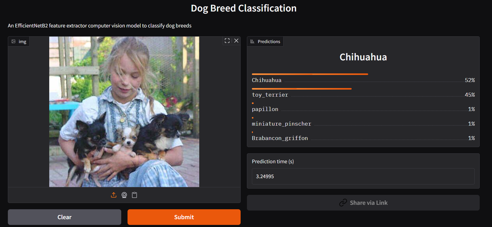

# Dog Breed Classification – Deployment

This repository contains the **demo version** of a Dog Breed Classification application. The application performs image-based inference to predict breed of a dog using a pre-trained deep learning model.

This `main` branch focuses exclusively on deployment and inference.  
All model training, dataset, experimentation, and evaluation workflows are maintained in a `experiment` branch.


## Demo
Try the demo in [Hugging Face](https://huggingface.co/spaces/Bernando-Virto/dog_breed_classification)


or you can also run this app locally


## Installation

### Prerequisites
- Python 3.8 or higher

### Setup

1.  Clone the repository

```bash
git clone https://github.com/bernandogunawan/dog-breed-classification.git
cd dog-breed-classification
```

2.  Then create a virtual environment
```bash
python -m venv venv
source venv/bin/activate  # Linux / macOS
venv\Scripts\activate     # Windows
```

3.  Install dependencies
```bash
pip install -r requirements.txt
```

4.  Run the app
```bash
python app.py
```

5. The app will be available at
```bash
http://localhost:7860
```

6. Open it on your browser

## Usage

1.  Open the Gradio web interface in your browser
2.  Upload an image of a dog
3.  Click Submit
4.  View the predicted breed and confidence score
